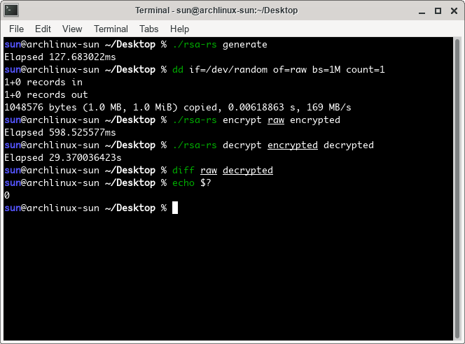

# rsa-rs: 使用Rust实现的RSA算法

## 1 示例

以Linux系统为例。

```bash
git clone https://github.com/sunziping2016/rsa-rs.git # 下载仓库
cd rsa-rs
cargo build --release # 以Release编译
cd target/release
./rsa-rs generate # 生成私钥和公钥，位于当前目录下的id_rsa和id_rsa.pub
dd if=/dev/random of=raw bs=1M count=1 # 随机生成1MB的文件raw
./rsa-rs encrypt raw encrypted # 用公钥加密raw到encrypted
./rsa-rs decrypt encrypted decrypted # 用私钥解密encrypted到decrypted
diff raw decrypted # 检查raw和decrypted是否有差异
```

运行结果如下：



## 2 构建说明

本工具使用Rust作为开发语言，是跨平台的，目前只支持x86_64架构。你可以在[Install Rust - Rust Programming Language](https://www.rust-lang.org/tools/install)找到安装Rust的方案。

构建的时候采用Cargo：

```bash
cargo build --release
```

这时候可执行文件就会在`target/release`下生成。

## 3 使用说明

### 3.1 生成密钥

```text
rsa-rs generate [-b bits] [-c comment] [-p prime-tests] [output]
```

其中参数如下：

- `bits`：膜n的长度，默认768；
- `comment`：生成的公钥私钥包含的注释，默认是`<username>@<hostname>`；
- `prime-tests`：Miller-Rabin素数检测次数，默认是32；
- `output`：输出的私钥路径，默认为`rsa`，同时会生成带有后缀`.pub`的公钥。

生成的私钥和公钥都是OpenSSH兼容的格式。我已经通过ssh命令验证了我生成的公钥和密钥的兼容性。

### 3.2 检查公钥密钥

```text
rsa-rs check [-e] [key]
```

其中参数如下：

- `-e`：关闭检查公钥，之检查私钥；
- `key`：私钥路径，假定公钥是同路径后缀`.pub`。

会检查私钥的$p$和$q$是否是素数、$n$是否等于$p\times q$等等。

### 3.3 加密文件

```text
rsa-rs encrypt [-k key] <input> <output>
```

其中参数如下：

- `key`：私钥路径，假定公钥是同路径后缀`.pub`。

使用公钥加密`input`文件成`output`文件。

### 3.4 解密文件

```text
rsa-rs decrypt [-k key] <input> <output>
```

其中参数如下：

- `key`：私钥路径

使用私钥解密`input`文件成`output`文件。

## 4 亮点

我认为有如下亮点：

- 良好的性能：经过测试，我的密钥生成速度、加解密速度略快于上一届梁健哲学长的实现；
- 跨平台支持：借助于Rust的跨平台性，我的实现得以在不同的系统的x86_64架构上运行起来，不过由于使用了x86_64独有的指令集完成高精度，所以还不支持所有架构；
- 兼容OpenSSH：自己编写对OpenSSH私钥公钥文件的解析和生成，从而可以实现交换OpenSSH和我的实现生成的私钥公钥；
- 良好的代码风格：代码使用了大量的范型，以使得实现了某些基本操作的无符号高精度类型可以立刻有对应的算法；
- 软件健壮性：大量使用了单元测试，确保软件正常工作。

## 5 感想和收获

学到了很多有用的知识。也锻炼了自己写Rust的技能。
